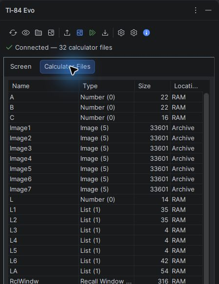
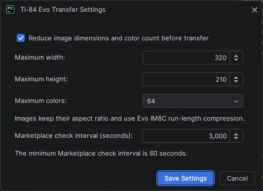

Calculator files and images
===========================

Open **Calculator Files** to manage variables on the connected calculator. The
sortable table shows each decoded name and type, its byte size, and whether it
is in RAM or Archive.

The table refreshes when you open or click its tab and after successful
variable, picture, Python, project, or Archive uploads. Existing selections are
preserved when the same calculator entries are still present.

   The file browser presents calculator variables in a sortable table. This
   read-only capture shows common numbers, images, and lists in RAM or Archive.

Choose an operation
-------------------

.. graphviz::
   :align: center

   digraph file_actions {
       rankdir=LR;
       graph [bgcolor="transparent", pad=0.15, nodesep=0.28, ranksep=0.45];
       node [shape=box, style="rounded,filled", fillcolor="#f3fbf5",
             color="#269745", fontcolor="#173b22", fontname="Arial",
             fontsize=10, margin="0.16,0.10"];
       edge [color="#52605a", fontcolor="#365141", fontname="Arial",
             fontsize=9, arrowsize=0.7];

       browse [label="Browse calculator files"];
       select [label="Select row(s)"];
       view [label="View / edit", fillcolor="#f6f0fd", color="#a161f0"];
       archive [label="Save to Archive", fillcolor="#f6f0fd", color="#a161f0"];
       delete [label="Delete selected", fillcolor="#fff4f2", color="#b14b3b"];
       add [label="Add variable", fillcolor="#f6f0fd", color="#a161f0"];
       picture [label="Upload picture", fillcolor="#f6f0fd", color="#a161f0"];

       browse -> select;
       select -> view [label="one row"];
       select -> archive [label="RAM row(s)"];
       select -> delete [label="one or more"];
       browse -> add;
       browse -> picture;
   }

Inspect, export, and edit
-------------------------

Select one row and choose **View / edit**. The viewer reads the complete native
Evo variable envelope and can save a lossless calculator-file copy for every
variable type.

Numbers, lists, and matrices are decoded into readable real, fraction, complex,
list, or matrix text. For these types, **Replace Value** opens a pre-populated
editor. **Add variable** creates a new number, list, or matrix from
comma/space-separated input. Other variable types remain available for raw
inspection and export but cannot be edited in the plugin.

Existing lists are replaced through a native list payload so their columns
remain registered in the calculator's List Editor.

Save variables to Archive
-------------------------

Select one or more variables currently in RAM and choose **Save to Archive**.
After each transfer, the plugin reads the calculator directory and verifies the
new location. If a later item fails, completed items remain in Archive and the
output identifies the failed variable.

Delete or clear variables
-------------------------

Select one or more rows and choose **Delete selected**. Review the name, type,
and location of every selected variable in the confirmation dialog.

.. warning::

   Deleted or cleared values cannot be recovered.

The built-in lists ``L1`` through ``L6`` are special: the action clears their
values and restores the default List Editor columns instead of deleting the
slots. Custom lists and all other selected variables are deleted normally.

For multi-selection operations, the plugin verifies each result against a fresh
directory read. If an operation stops partway through, the output distinguishes
completed clears/deletions from the item that failed.

Upload a picture
----------------

Choose **Upload picture** and select one of these inputs:

* PNG, JPEG, GIF, or BMP for conversion by the plugin
* ``.8ci2``, ``.8ca2``, or ``.8xv2`` for transfer without conversion

Converted images become palette-based, run-length-compressed Evo Python image
variables that can be opened with ``ti_image.load_image(name)``.

On firmware 7.0, type-8 Python image variables cannot be retained in RAM. If a
RAM image upload is rejected with that firmware's invalid-payload response,
the plugin retries the native image file in Archive and reports its actual
location.

An image variable name must begin with a letter and contain one to eight
uppercase letters, digits, or underscores. The dialog normalizes entered names
to uppercase.

Use **Transfer settings** to control dimension reduction, maximum width and
height, and palette size. The plugin preserves the aspect ratio. These settings
are stored in PyCharm's user configuration and apply to every project.

   Image limits apply during conversion; the Marketplace interval controls
   background version checks. The values shown here are examples.

Capture the screen
------------------

Choose **Capture screen** to display the calculator framebuffer in the
**Screen** tab. Save the original full-resolution capture as a PNG with either:

* **Save As…**, which opens a destination chooser and confirms replacement; or
* **Save to Project Dir**, which creates a timestamped name and adds a numeric
  suffix rather than overwriting an existing file.

The same actions are available from the screenshot's context menu.

Next steps
----------

For Python programs, continue with :doc:`projects`. For connection failures or
partial operations, see :doc:`troubleshooting`.
