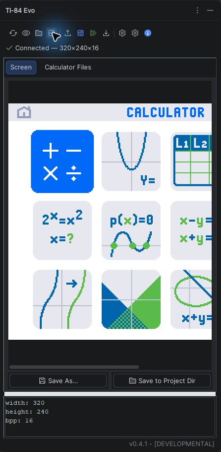
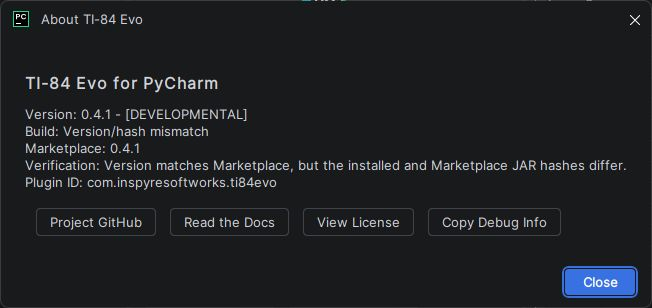

Getting started
===============

This page takes you from installation to a verified calculator connection and
your first Python upload. After that, use :doc:`calculator-files` for variables
and pictures or :doc:`projects` for multi-file synchronization.

What you need
-------------

* PyCharm 2026.2 or newer
* A TI-84 Evo
* A USB data cable (some charging cables do not carry data)

Java is not required to use the PyCharm plugin. Install JDK 25 only when you
want to :doc:`build from source <development>` or use the :doc:`companion CLI
<cli>`.

Install the plugin
------------------

In PyCharm:

1. Open **Settings → Plugins → Marketplace**.
2. Search for **TI-84 Evo**.
3. Select **Install** and restart PyCharm if prompted.

You can instead download a plugin ZIP from the `JetBrains Marketplace
<https://plugins.jetbrains.com/plugin/33854-ti-84-evo>`_ or a matching `GitHub
release <https://github.com/Inspyre-Softworks/ti84-evo-for-pycharm/releases>`_.
Install it with **Settings → Plugins → ⚙ → Install Plugin from Disk**.

Connect and verify
------------------

.. graphviz::
   :align: center

   digraph first_connection {
       rankdir=LR;
       graph [bgcolor="transparent", pad=0.15, nodesep=0.3, ranksep=0.4];
       node [shape=box, style="rounded,filled", fillcolor="#f3fbf5",
             color="#269745", fontcolor="#173b22", fontname="Arial",
             fontsize=10, margin="0.16,0.10"];
       edge [color="#52605a", fontcolor="#365141", fontname="Arial",
             fontsize=9, arrowsize=0.7];

       cable [label="Connect USB\ndata cable"];
       window [label="Open TI-84 Evo\ntool window"];
       refresh [label="Refresh\ndevices"];
       attributes [label="Read\nattributes"];
       ready [label="Connection\nverified", fillcolor="#e8f5ec"];

       cable -> window -> refresh -> attributes -> ready;
   }

1. Connect and wake the calculator.
2. Open **View → Tool Windows → TI-84 Evo**.
3. Select **Refresh devices**. Exactly one TI-84 Evo must be connected.
4. Select **Read attributes**.

   A connected calculator after a successful screen capture. The status line
   confirms both the connection and the captured framebuffer dimensions.

The attributes dialog groups the calculator details into readable categories.
**Copy Attributes** places a Markdown report on the clipboard, including the
original protocol keys for diagnostics.

If the calculator is not found or the operation times out, follow
:doc:`troubleshooting` before attempting a write.

Upload your first Python file
-----------------------------

1. Open a ``.py`` file in the editor.
2. Select **Upload current Python file** in the TI-84 Evo tool window.
3. Enter a calculator program name containing one to eight letters or digits.
4. Choose RAM or Archive and confirm the upload.

The plugin reads the current editor document, so unsaved changes are included.
It normalizes the calculator name to uppercase and replaces an existing Python
program with the same name.

.. important::

   Keep backups of important calculator data. This is an alpha
   hardware-integration project. Release 0.4.2 passed the complete project,
   variable, image, and screenshot matrix on one physical TI-84 Evo and
   Windows 11 host; other firmware and host configurations still need testing.
   See :doc:`hardware-acceptance` for the accepted configuration.

TI Python editor support
------------------------

The plugin provides completion, parameter hints, quick documentation, and
type-aware inspections for these calculator modules:

* ``ti_draw``
* ``ti_hub``
* ``ti_image``
* ``ti_plotlib``
* ``ti_rover``
* ``ti_system``

The bundled ``.pyi`` files form an editor-only :term:`synthetic library`. They
are not desktop implementations of the modules and are never uploaded to the
calculator.

Version status and diagnostics
------------------------------

The tool-window footer shows the installed plugin version. On startup and at a
configurable interval, the plugin compares it with the public JetBrains
Marketplace release. A label may indicate that the build is **OUTDATED**,
**DEVELOPMENTAL**, or **UNVERIFIED**; hover over the footer or open **About
TI-84 Evo** for the explanation.

The About window can retry an unavailable Marketplace check and copy sanitized
Markdown debug information. The check interval is available under **Transfer
settings**; the normal minimum is 60 seconds and the default is one hour.
Plugin developers who need expanded validation controls can use
:doc:`marauders-lock`.

   **About TI-84 Evo** keeps the installed version, Marketplace comparison,
   and diagnostic actions in one place. This capture shows a development
   build; release-build status text will differ.

Where to go next
----------------

.. grid:: 1 1 2 2
   :gutter: 2

   .. grid-item-card:: Manage calculator files
      :link: calculator-files
      :link-type: doc

      Browse, inspect, export, edit, archive, delete, and upload pictures.

   .. grid-item-card:: Synchronize a project
      :link: projects
      :link-type: doc

      Configure, push, and pull a multi-file Python project safely.

   .. grid-item-card:: Use the PowerShell CLI
      :link: cli
      :link-type: doc

      Send files outside PyCharm and add optional Explorer actions.

   .. grid-item-card:: Fix a connection problem
      :link: troubleshooting
      :link-type: doc

      Work through detection, timeout, conflict, and reporting guidance.
