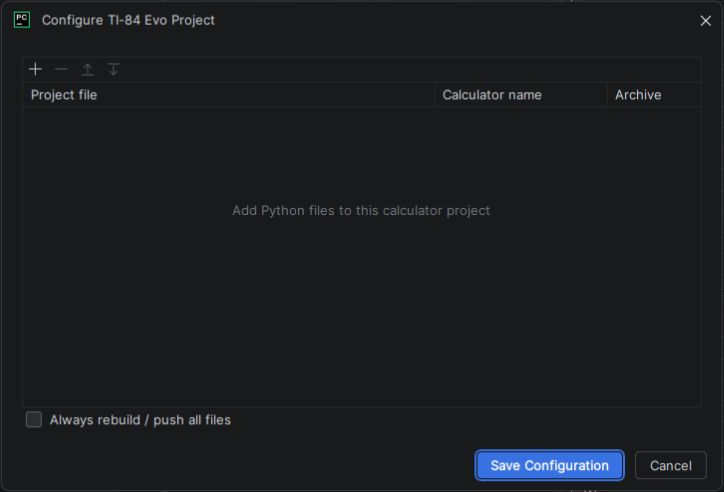

Multi-file projects
===================

A TI-84 Evo project maps local Python files to calculator program names and a
RAM or Archive target. The plugin stores that mapping in
``.ti84-evo-project`` at the project root.

Configure a project
-------------------

Choose **Configure project** to add or remove Python files, set calculator
names, choose storage targets, and arrange the entries.

   Each row maps one local Python file to a calculator program name and a RAM
   or Archive destination.

.. code-block:: properties

   @always-push-all=false
   lib/drawing.py=DRAW|Archive
   lib/state.py=STATE|RAM
   main.py=MAIN|RAM

Manifest rules:

* paths are relative to the project root and must remain inside it;
* calculator names must be unique and contain one to eight letters or digits;
* each line selects RAM or Archive; and
* entries are uploaded in manifest order.

The configuration window writes entries sorted by source path. To use a
different upload order, edit the manifest line order afterward. The file is
designed to be committed to source control.

Push local changes
------------------

**Push project** reads unsaved manifest and editor changes, compares each
configured entry with local synchronization state and the live calculator
directory, and sends only the entries that need it.

.. graphviz::
   :align: center

   digraph push_decision {
       rankdir=TB;
       graph [bgcolor="transparent", pad=0.15, nodesep=0.3, ranksep=0.42];
       node [shape=box, style="rounded,filled", fillcolor="#f3fbf5",
             color="#269745", fontcolor="#173b22", fontname="Arial",
             fontsize=10, margin="0.16,0.10"];
       edge [color="#52605a", fontcolor="#365141", fontname="Arial",
             fontsize=9, arrowsize=0.7];
       decision [shape=diamond, label="Source fingerprint\nunchanged?"];
       present [shape=diamond, label="Program present at\nrequested location?"];
       skip [label="Skip entry", fillcolor="#e8f5ec"];
       upload [label="Upload entry", fillcolor="#f6f0fd", color="#a161f0"];
       record [label="Record successful\nsynchronization"];

       decision -> upload [label="no"];
       decision -> present [label="yes"];
       present -> skip [label="yes"];
       present -> upload [label="no"];
       upload -> record;
   }

A program deleted from the calculator—or moved between RAM and Archive—is
therefore restored on the next push even if its local source is unchanged.
Successful entries are recorded one at a time, so retrying after a partial
failure does not resend completed files that are still present.

Enable **Always rebuild / push all files** when calculators are frequently
reset or when the same project is sent to several calculators. If a normal push
finds everything current, **Push Anyway** is available as a one-time override.

Pull calculator programs
------------------------

**Pull project** downloads every type-15 Python program from the calculator,
decodes its UTF-8 source, and rebuilds the local files and manifest.

.. graphviz::
   :align: center

   digraph pull_flow {
       rankdir=LR;
       graph [bgcolor="transparent", pad=0.15, nodesep=0.3, ranksep=0.4];
       node [shape=box, style="rounded,filled", fillcolor="#f3fbf5",
             color="#269745", fontcolor="#173b22", fontname="Arial",
             fontsize=10, margin="0.16,0.10"];
       edge [color="#52605a", fontcolor="#365141", fontname="Arial",
             fontsize=9, arrowsize=0.7];

       directory [label="Read calculator\nPython programs"];
       map [label="Reuse manifest paths\nor choose safe names"];
       compare [label="Compare local\ncontents"];
       confirm [label="Review conflicts"];
       write [label="Write files, manifest,\nand sync state"];

       directory -> map -> compare -> confirm -> write;
   }

Existing manifest paths are reused by calculator program name. New programs
receive deterministic lowercase ``.py`` filenames, and RAM/Archive targets are
preserved. The confirmation identifies local files with different contents;
they are replaced only after you explicitly choose **Overwrite and Pull**.

Pulled files are marked synchronized, so the next normal push does not
immediately resend them.

Safety notes
------------

* Keep ``.ti84-evo-project`` in version control, but do not rely on it as a
  backup of calculator contents.
* Review every pull conflict before allowing replacement.
* After a partial push or pull failure, read the output before retrying; it lists
  completed entries.
* See :doc:`troubleshooting` when the calculator cannot be reached.
