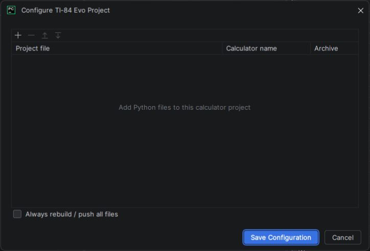

Multi-file projects
===================

A TI-84 Evo project maps local Python files to calculator program names and a
:term:`RAM` or :term:`Archive` target. The plugin stores that mapping in
``.ti84-evo-project`` at the project root.

Configure a project
-------------------

Choose **Configure project** to add or remove Python files, set calculator
names, choose storage targets, and arrange the entries.

   Each row maps one local Python file to a calculator program name and a RAM
   or Archive destination.

.. code-block:: properties

   @always-push-all=false
   lib/drawing.py=DRAW|Archive
   lib/state.py=STATE|RAM
   main.py=MAIN|RAM

Manifest rules:

* paths are relative to the project root and must remain inside it;
* calculator names must be unique and contain one to eight letters or digits;
* each line selects RAM or Archive; and
* entries are uploaded in manifest order.

The configuration window writes entries sorted by source path. To use a
different upload order, edit the manifest line order afterward. The file is
designed to be committed to source control.

Push local changes
------------------

**Push project** reads unsaved manifest and editor changes, compares each
configured entry with local synchronization state and the live calculator
directory, and sends only the entries that need it.

.. graphviz::
   :align: center

   digraph push_decision {
       rankdir=TB;
       graph [bgcolor="transparent", pad=0.15, nodesep=0.3, ranksep=0.42];
       node [shape=box, style="rounded,filled", fillcolor="#f3fbf5",
             color="#269745", fontcolor="#173b22", fontname="Arial",
             fontsize=10, margin="0.16,0.10"];
       edge [color="#52605a", fontcolor="#365141", fontname="Arial",
             fontsize=9, arrowsize=0.7];
       decision [shape=diamond, label="Source fingerprint\nunchanged?"];
       present [shape=diamond, label="Program present at\nrequested location?"];
       skip [label="Skip entry", fillcolor="#e8f5ec"];
       upload [label="Upload entry", fillcolor="#f6f0fd", color="#a161f0"];
       record [label="Record successful\nsynchronization"];

       decision -> upload [label="no"];
       decision -> present [label="yes"];
       present -> skip [label="yes"];
       present -> upload [label="no"];
       upload -> record;
   }

A program deleted from the calculator—or moved between RAM and Archive—is
therefore restored on the next push even if its local source is unchanged.
Successful entries are recorded one at a time, so retrying after a partial
failure does not resend completed files that are still present.

Enable **Always rebuild / push all files** when calculators are frequently
reset or when the same project is sent to several calculators. If a normal push
finds everything current, **Push Anyway** is available as a one-time override.

Run a project
-------------

A run configuration combines the normal incremental project push with a launch
of one configured Python program. Create it after configuring the project:

1. Connect and wake the calculator.
2. Choose **Run | Edit Configurations**.
3. Select **Add New Configuration** and then **TI-84 Evo Python Project**.
4. Give the configuration a useful name, such as ``Run MAIN``.
5. Leave **Project manifest** as ``.ti84-evo-project`` when the manifest is in
   the open PyCharm project directory. For a nested project, enter its path
   relative to that directory, such as ``calculator/.ti84-evo-project``.
6. Choose or type the **Launch program** calculator name. This is the name on
   the right side of a manifest entry, not the local filename. For
   ``main.py=MAIN|RAM``, select ``MAIN``.
7. Optionally enable **Open live screen viewer after launch** to watch the
   calculator display in a separate PyCharm window. It is off by default.
8. Select **Apply**, then run the configuration from the PyCharm toolbar or
   **Run** menu.

The program list is populated from the selected manifest when the configuration
editor opens. The field remains editable, so a newly added program can be typed
directly. If you switch to another manifest, apply and reopen the configuration
to refresh the suggestions.

Launch-target rules
~~~~~~~~~~~~~~~~~~~

The launch program:

* must be declared in the selected manifest;
* must be stored in :term:`RAM`, not Archive;
* must have a calculator name that begins with a letter; and
* must otherwise follow the normal one-to-eight-letter-or-digit name rule.

Only the launch target must be in RAM. Supporting modules may remain in Archive
and are still synchronized before the target starts. PyCharm validates these
rules before opening the USB connection and shows an actionable configuration
error when the selection is invalid.

What happens when Run is selected
~~~~~~~~~~~~~~~~~~~~~~~~~~~~~~~~~

The run reads the current manifest and every declared source. Unsaved editor
contents are used, so saving files first is not required. It then:

1. connects to the single available TI-84 Evo;
2. reads the calculator directory and compares the project using the same
   synchronization state as **Push project**;
3. uploads only changed, missing, or incorrectly located entries, unless
   ``@always-push-all=true`` requests a complete push;
4. returns the calculator to its Home screen;
5. opens the Python File Manager, selects the configured RAM program, and sends
   its **Run** action;
6. opens the live screen viewer when that option is enabled; and
7. ends the PyCharm run after the launch command has been dispatched.

The Run console identifies the connection, comparison, each completed upload,
the launch, and the final uploaded/skipped counts. A current project is not
uploaded again, but its selected program is still launched.

The optional live viewer starts only after the launch connection has closed,
then uses its own read-only USB connection to refresh the calculator's
``320 x 240`` framebuffer. It remains open after the PyCharm Run process ends.
Starting the run configuration again closes its previous viewer before
reconnecting and opens a fresh viewer after launch. Close the viewer window
manually to release its USB connection before using another calculator-link
application or starting a different plugin operation that needs the same port.

The launcher uses the File Manager's alphabetic jump followed by local
navigation among programs with the same first letter. This makes the result
independent of whichever Python file was selected on the calculator previously.
Returning Home and opening Python are visible on the calculator and will replace
the screen or menu currently displayed there.

Run-console limits and stopping
~~~~~~~~~~~~~~~~~~~~~~~~~~~~~~~

The PyCharm Run console reports host-side synchronization and launch progress;
it is not a calculator terminal. It does not display the program's ``print``
output, accept ``input`` values, or provide breakpoints and debugging. Interact
with the running program on the calculator. The optional live viewer mirrors
the calculator display only; it does not send key presses or turn displayed
text into Run-console output.

Selecting **Stop** cancels between calculator protocol operations. A transfer
already in progress may finish before cancellation is observed. After the final
Run key has been sent, the PyCharm process has no remote process to terminate;
stop the Python program on the calculator itself. Stopping the Run process also
does not close a viewer that has already opened; close its window separately.

Common configuration errors
~~~~~~~~~~~~~~~~~~~~~~~~~~~

.. list-table::
   :header-rows: 1
   :widths: 38 62

   * - Message or symptom
     - Resolution
   * - The manifest cannot be read
     - Check **Project manifest**. Relative paths start at the open PyCharm
       project directory, and every declared source must exist.
   * - Select a launch program declared by the manifest
     - Enter the calculator name from the right side of a manifest entry, such
       as ``MAIN``, rather than ``main.py``.
   * - The launch program must use RAM
     - Change that entry from ``Archive`` to ``RAM`` with **Configure project**.
   * - Launch program names must start with a letter
     - Rename the calculator program in the project configuration. Names such
       as ``MAIN2`` work; names such as ``2MAIN`` cannot be selected reliably
       through File Manager alphabetic search.
   * - No calculator is found or the connection times out
     - Wake the calculator, check the USB data cable, and close other calculator
       link software. Continue with :doc:`troubleshooting` if it still fails.

Pull calculator programs
------------------------

**Pull project** downloads every type-15 Python program from the calculator,
decodes its UTF-8 source, and rebuilds the local files and manifest.

.. graphviz::
   :align: center

   digraph pull_flow {
       rankdir=LR;
       graph [bgcolor="transparent", pad=0.15, nodesep=0.3, ranksep=0.4];
       node [shape=box, style="rounded,filled", fillcolor="#f3fbf5",
             color="#269745", fontcolor="#173b22", fontname="Arial",
             fontsize=10, margin="0.16,0.10"];
       edge [color="#52605a", fontcolor="#365141", fontname="Arial",
             fontsize=9, arrowsize=0.7];

       directory [label="Read calculator\nPython programs"];
       map [label="Reuse manifest paths\nor choose safe names"];
       compare [label="Compare local\ncontents"];
       confirm [label="Review conflicts"];
       write [label="Write files, manifest,\nand sync state"];

       directory -> map -> compare -> confirm -> write;
   }

Existing manifest paths are reused by calculator program name. New programs
receive deterministic lowercase ``.py`` filenames, and RAM/Archive targets are
preserved. The confirmation identifies local files with different contents;
they are replaced only after you explicitly choose **Overwrite and Pull**.

Pulled files are marked synchronized, so the next normal push does not
immediately resend them.

Safety notes
------------

* Keep ``.ti84-evo-project`` in version control, but do not rely on it as a
  backup of calculator contents.
* Review every pull conflict before allowing replacement.
* After a partial push or pull failure, read the output before retrying; it lists
  completed entries.
* Stopping an IDE run cancels work between protocol operations. After the final
  Run key has been sent, the calculator program must be stopped on the calculator.
* See :doc:`troubleshooting` when the calculator cannot be reached.
